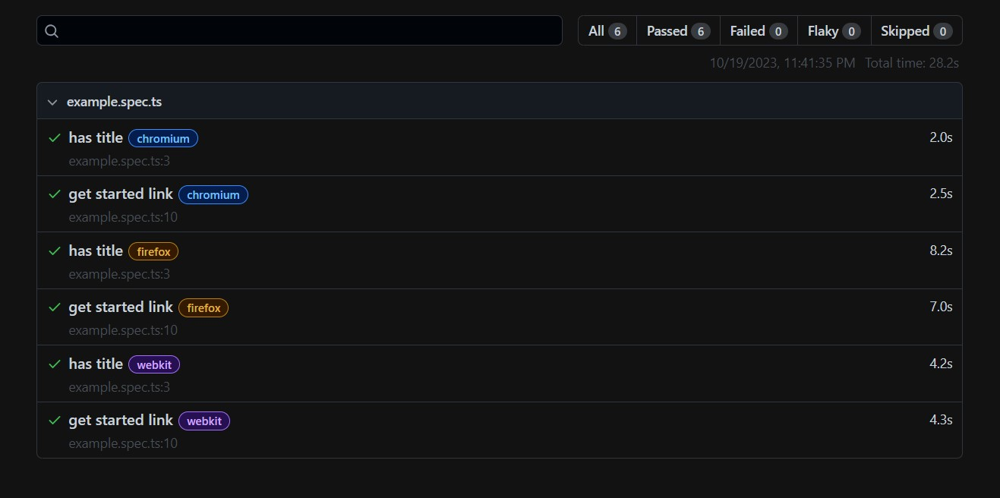

# Test Automation Project

This is a Test Automation project using TypeScript and the Playwright Test Framework to accomodate the needs of end-to-end testing.

## Requirements

### System Requirements

- Windows: Works perfectly fine with windows 10 or above or on the windows subsystem for Linux.
- Mac OS: MacOS 12 Monterey or MacOS 13 Ventura.
- Linux: Depending on the version of Linux, additional dependencies are needed to run the browsers. Only Ubuntu 18.04 and 20.04 are officially supported.

### Prerequisites

- Node.js: Playwright requires Node.js version 16 or above. Run node -v from the command line to make sure you have a compatible version of Node.js. The browser binaries for Chromium, Firefox and WebKit work across Windows, macOS, and Linux.
- Visual Studio Code: This is the best IDE to work with Playwright.

## Installation

- Clone the repository to your local machine
- Install the dependencies

  ```bash
   npm install
  ```

- Run the tests

  - Headed (With Browser UI) on all the 3 Browsers
    (Chromium, Firefox and WebKit)

  ```bash
  npm test
  ```

  - To execute the tests on Chromium Browser

  ```bash
  npm run test:chrome
  ```

  - To execute the tests on Firefox Browser

  ```bash
  npm run test:firefox
  ```

  - To execute the tests on Webkit Browser

  ```bash
  npm run test:webkit
  ```

  - To see the results of the test

  ```bash
  npm run playwright:report
  ```

  
