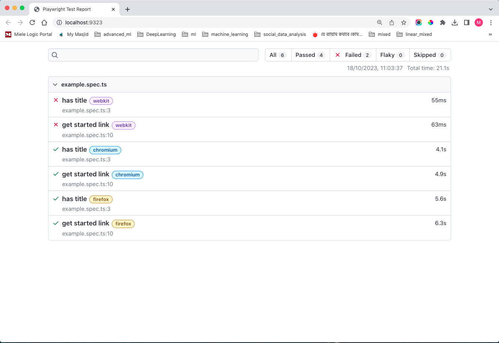
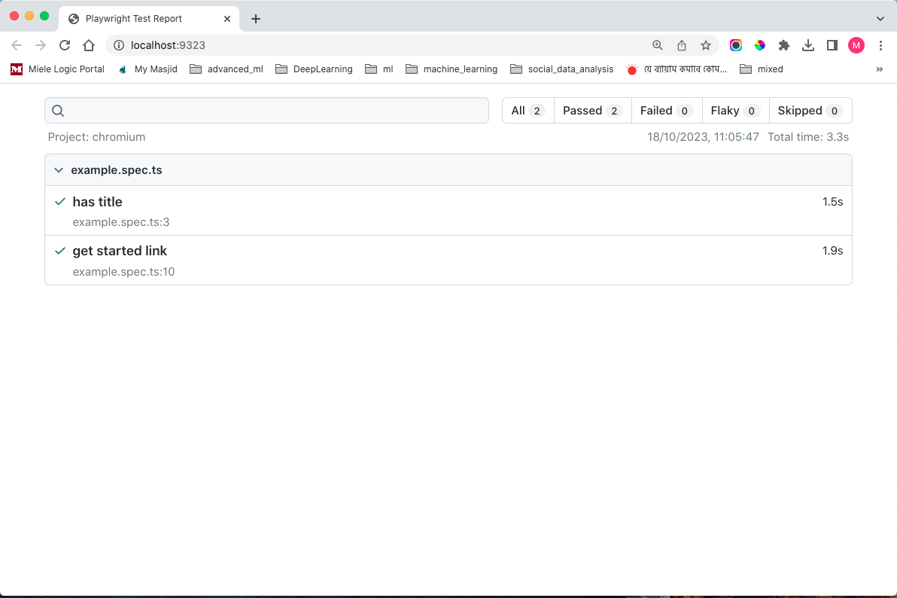

# QA-Masterclass: Web Automation Testing using Playwright
QA Engineering Masterclass week 03, in this class a new test automation project using Playwright in TypeScript is created. This GitHub repository demonstrates how to setup and run the `Playwright` test automation framework for web apps on multiple web browsers: Chrome, Firefox, and webKit (Safari).

## Prerequisites

In order to utilise this project the following tools are required to be installed locally:

1. A recent version of [Node.js](https://nodejs.org/).
2. A good coding editor like [Visual Studio Code](https://code.visualstudio.com/).


## Installation

```
git clone https://github.com/HackYourFuture-CPH/qa-masterclass
```

## Running the Example automation test

1. Navigate to the root directory:

```
cd qa-masterclass
```

2. Install dependencies required to run the tests:

```
npm install
```

3. To run the test in all three web browsers : Chrome, Firefox, and webKit (Safari)

```
npm test
```

4. To run the test only in Chrome

```
npm run test:chrome
```

5. To view the test report

```
npm run playwright:report
```
## Sample code for this project
The code below test for two automation test cases:
1. First one look for a title named `Playwright`
2. Second one check for link `GET STARTED` works or not

### Code 

```
import { test, expect } from '@playwright/test';

test('has title', async ({ page }) => {
  await page.goto('https://playwright.dev/');

  // Expect a title "to contain" a substring.
  await expect(page).toHaveTitle(/Playwright/);
});

test('get started link', async ({ page }) => {
  await page.goto('https://playwright.dev/');

  // Click the get started link.
  await page.getByRole('link', { name: 'Get started' }).click();

  // Expects page to have a heading with the name of Installation.
  await expect(page.getByRole('heading', { name: 'Installation' })).toBeVisible();
});

```
## Results

### Test results while testing with three browsers (Chrome, Firefox, and webKit)


N.B: From the above image it can be seen that the test is passed for both firefox and chrome browser but it fails in case of webkit (safari). This is because this version of Playwright does not support running WebKit on my MacOS 10.15.

### Test results while testing only with Chrome


## Author

- Linked In - [Alamgir Kabir](https://www.linkedin.com/in/mdagkabir)