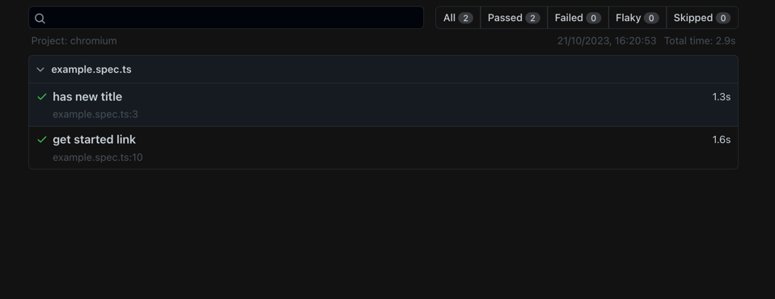

# qa-masterclass
QA Engineering Masterclass week-3 homework By Planday 

## Table of contents
  - [Overview](#overview)
    - [Built with](#built-with)
    - [Installation & Setup](#installation--setup)
    - [Run Tests](#run-tests)
    - [Test Reports](#test-reports)
    - [screenshot](#screenshot)
    - [What I learned](#what-i-learned)
  
## Overview

This TypeScript-based Test Automation project uses the Playwright Framework for end-to-end testing.

### Built with

- [TypeScript](https://www.typescriptlang.org/)
- [Node.js](https://nodejs.org/)
- [Playwright](https://playwright.dev/docs/intro#installing-playwright)

### Installation & Setup

- Install Node.js (if not already installed) from [here](https://nodejs.org/en/download/)
- Install the latest version of [Visual Studio Code](https://code.visualstudio.com/download)
- Open Visual Studio Code
- Open a new terminal in Visual Studio Code
- Clone the repository to your local machine:

       git clone https://github.com/HackYourFuture-CPH/qa-masterclass.git

- Navigate to the project's root directory:

       cd qa-masterclass

- Install dependencies in the project's root directory:

       npm install

### Run Tests

to run the test in all 3 browsers ( chrome, firefox, webkit )
```bash
npm run test
```

to run tests in Chrome
```bash
npm run test:chrome
```

### Test Reports

Test results are reported using the built-in Playwright test runner.

to show the test report  
```bash
 npm run playwright:report
 ```

### screenshot

scrrenshot of the test report



 ### What I learned

This is my first sample testing project using the playwright test framework.

  

